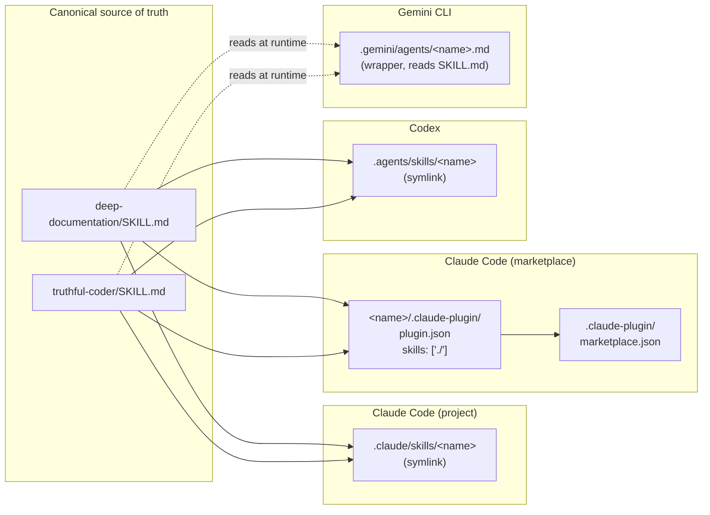

# Architecture

The repo follows a **canonical-folder + adapter** pattern so every supported agent loads the same source of truth.

## Folder layout

```
agent-skills/
├── README.md                           project overview + skill catalog
├── CHANGELOG.md                        append-only history
├── LICENSE
├── llms.txt                            concise LLM index
├── llms-full.txt                       bundled docs for ingestion
│
├── docs/                               browsable documentation
│   ├── README.md                       this index
│   ├── install.md                      per-agent install guide
│   ├── architecture.md                 (this page)
│   └── contributing.md                 how to add a new skill
│
├── deep-documentation/                 ← canonical skill folder
│   ├── SKILL.md                        ← source of truth
│   └── .claude-plugin/plugin.json      Claude Code plugin manifest
│
├── truthful-coder/                     ← canonical skill folder
│   ├── SKILL.md                        ← source of truth
│   └── .claude-plugin/plugin.json      Claude Code plugin manifest
│
├── .claude-plugin/
│   └── marketplace.json                marketplace catalog (`adamdroberts-skills`)
│
├── .claude/
│   ├── README.md                       Claude Code-specific notes
│   └── skills/                         project-skill adapters
│       ├── deep-documentation -> ../../deep-documentation
│       └── truthful-coder    -> ../../truthful-coder
│
├── .agents/
│   └── skills/                         Codex adapters (symlinks)
│       ├── deep-documentation -> ../../deep-documentation
│       └── truthful-coder    -> ../../truthful-coder
│
├── .gemini/
│   ├── agents/                         Gemini wrappers (NOT symlinks)
│   │   ├── deep-documentation.md       reads canonical SKILL.md at runtime
│   │   └── truthful-coder.md
│   └── settings.example.json           optional Gemini agent overrides
│
└── .codex/
    └── config.example.toml             optional per-skill Codex config
```

## How distribution works

Each supported agent looks up skills in a different location, so the repo provides one **adapter** per agent that points back at the canonical root folder.



## Why the adapters differ

| Agent | Adapter type | Reason |
|-------|--------------|--------|
| Claude Code (project) | Symlink | Claude Code resolves `.claude/skills/<name>/SKILL.md` and follows symlinks transparently. |
| Claude Code (marketplace) | Plugin manifests | The marketplace catalog references each canonical folder as a plugin source. Each plugin's `plugin.json` sets `"skills": ["./"]` so the SKILL.md at the plugin root is loaded directly, with the skill name coming from the SKILL.md frontmatter. |
| Codex | Symlink | Codex discovers skills under `.agents/skills/` and follows symlinks. |
| Gemini CLI | Markdown wrapper | Gemini does not natively load `SKILL.md` files, so the wrapper is a Gemini agent that locates and reads the canonical `SKILL.md` at runtime and treats it as authoritative. |

The wrapper-vs-symlink split is forced by the agents themselves, not a stylistic choice: an environment that ignores symlinks would break Claude Code and Codex equally, and Gemini's agent format requires a markdown file with its own frontmatter.

## Plugin marketplace internals

Two design choices shape the Claude Code plugin layout:

1. **Plugin per skill**, not one bundled plugin. Lets users install only the skills they want (`/plugin install truthful-coder@adamdroberts-skills`).
2. **Plugin root === canonical skill folder**, not a separate `plugins/` directory. The `plugin.json` lives next to the existing `SKILL.md` and uses the special `skills: ["./"]` form documented in the [Claude Code plugins reference](https://code.claude.com/docs/en/plugins-reference) — that form means "the SKILL.md sits at the plugin root; load it directly". This avoids restructuring the canonical content into `skills/<name>/SKILL.md` subdirectories.

When Claude Code installs a plugin, it copies the plugin's directory into `~/.claude/plugins/cache/<marketplace>/<plugin>/<sha>/`. Because the canonical folder *is* the plugin root, the entire skill (SKILL.md plus any sibling assets) is copied as a self-contained unit. There are no out-of-plugin symlinks to break.

The marketplace name is `adamdroberts-skills`; the literal `agent-skills` is on Anthropic's reserved-names list.

## Versioning

No `version` field is set in either `marketplace.json` or the per-plugin `plugin.json`. Per the marketplace docs, this means Claude Code uses the **git commit SHA** as the version, so every commit on `main` is a new version and `/plugin marketplace update` will pull it. Pin a `version` string only when you want to control update timing explicitly.

## What canonical means here

The root skill folders are the *only* place skill content is edited. All other entries — `.claude/skills/<name>`, `.agents/skills/<name>`, the plugin manifests — point back at them. If your environment cannot follow symlinks, copy the canonical folder into place rather than editing a copy somewhere else.
